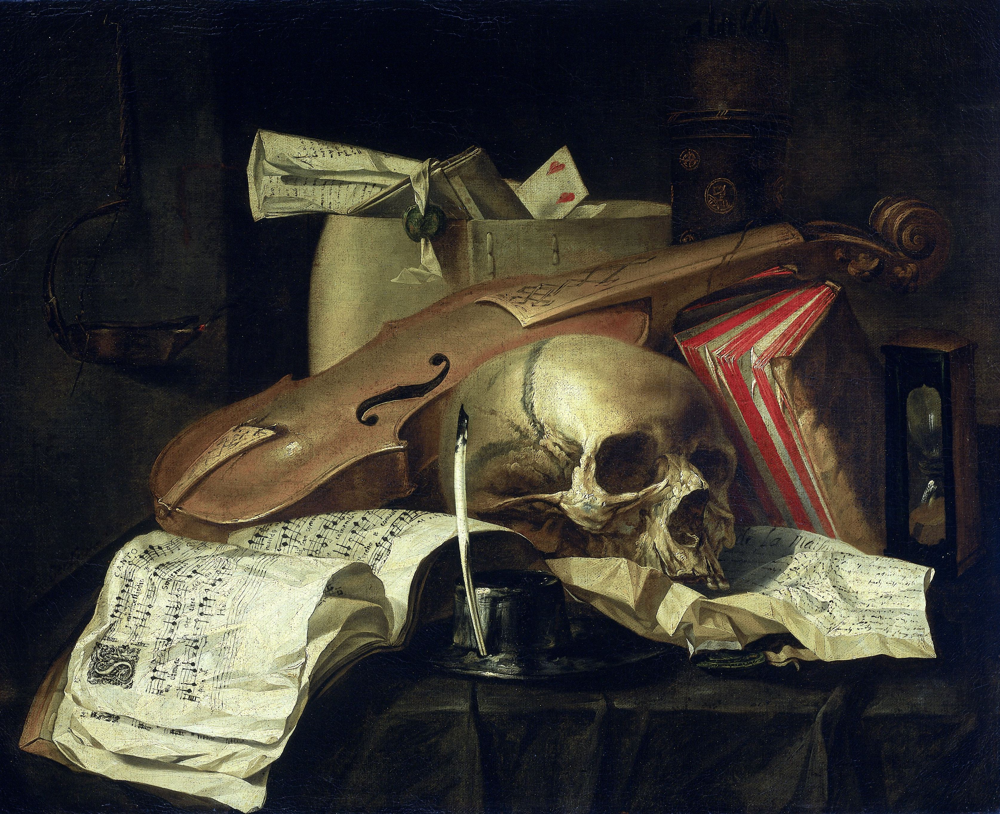

Vanitas stillife by N.L. Peschier, 1660.

# Rijksbot

[Rijksbot](https://twitter.com/Rijks_bot/with_replies) is a twitter bot that responds to mentions with an image from the [Rijksmuseum](https://www.rijksmuseum.nl/), using the tweet as a serch term.

This project was started at a Rails Girls Berlin Code & Cake event in 2017.

# Contributing
We gladly accept contributions to this project. Get in touch with thoughts and ideas.

<!-- ALL-CONTRIBUTORS-BADGE:START - Do not remove or modify this section -->
[](#contributors-)
<!-- ALL-CONTRIBUTORS-BADGE:END -->

#### Add your Rijksmuseum API key:
Add an account and ask for a  [Rijksmuseum API](https://www.rijksmuseum.nl/en/api) Key. You will recieve the key via email. It will only take you few minutes.

Add a .env file in the root file with your API key:

\# .env
```console
RIJKSMUSEUM_API_KEY=ZuSiGYl9 # without quotes, this is an example & fake key
```

#### Make all your tests green/passing:


1. install gems
```
bundle
```

2. Change :record => :none to :once to record new episodes.
\# test/support/vcr.rb

```ruby
config.default_cassette_options = { allow_unused_http_interactions: false, :record => :once }
```

3. run:
```console
rake test
```

4.  change 'test/support/vcr.rb' again to
```ruby
:record => :none
```
or rather:
```console
git checkout test/support/vcr.rb
```

5. check the failing test, and change the timestamp to the actual one.
Example:

\# failing test output:
```console
--- expected
+++ actual
@@ -1 +1 @@
-"Wed, 02 May 2018 22:14:01 GMT"
+"Tue, 22 May 2018 10:27:02 GMT"
```

\# rijksmus-api/client_test.rb:18

```ruby
subject.images.headers["date"].must_equal "Tue, 22 May 2018 00:00:29 GMT"
```

6. Git add and commit your changes. Example:
```ruby
git add . # check your changes before with git diff and do the propper cleaning/commits.
git commit -m 'update timestamp client_test'
```

7. Congratulations! All tests should be green/passing and you are start doing your first contribution!

# License
MIT

## Contributors ✨

Thanks goes to these wonderful people ([emoji key](https://allcontributors.org/docs/en/emoji-key)):

<!-- ALL-CONTRIBUTORS-LIST:START - Do not remove or modify this section -->
<!-- prettier-ignore-start -->
<!-- markdownlint-disable -->
<table>
  <tr>
    <td align="center"><a href="http://www.danielsenff.de/"><br /><sub><b>Daniel Senff</b></sub></a><br /><a href="https://github.com/nynnejc/rijks-bot/commits?author=Dahie" title="Code">💻</a> <a href="#maintenance-Dahie" title="Maintenance">🚧</a></td>
    <td align="center"><a href="https://github.com/cbuggle"><br /><sub><b>Christian Buggle</b></sub></a><br /><a href="#maintenance-cbuggle" title="Maintenance">🚧</a> <a href="https://github.com/nynnejc/rijks-bot/commits?author=cbuggle" title="Tests">⚠️</a></td>
    <td align="center"><a href="https://github.com/Haimchen"><br /><sub><b>Sarah</b></sub></a><br /><a href="https://github.com/nynnejc/rijks-bot/commits?author=Haimchen" title="Code">💻</a> <a href="#maintenance-Haimchen" title="Maintenance">🚧</a> <a href="https://github.com/nynnejc/rijks-bot/commits?author=Haimchen" title="Tests">⚠️</a></td>
    <td align="center"><a href="https://tonextflow.com/"><br /><sub><b>Tonio Serna</b></sub></a><br /><a href="https://github.com/nynnejc/rijks-bot/commits?author=nelantone" title="Code">💻</a> <a href="https://github.com/nynnejc/rijks-bot/commits?author=nelantone" title="Documentation">📖</a> <a href="#ideas-nelantone" title="Ideas, Planning, & Feedback">🤔</a> <a href="#infra-nelantone" title="Infrastructure (Hosting, Build-Tools, etc)">🚇</a> <a href="#mentoring-nelantone" title="Mentoring">🧑‍🏫</a> <a href="https://github.com/nynnejc/rijks-bot/commits?author=nelantone" title="Tests">⚠️</a></td>
    <td align="center"><a href="http://nynnechristoffersen.com/"><br /><sub><b>Nynne Just Christoffersen</b></sub></a><br /><a href="https://github.com/nynnejc/rijks-bot/commits?author=nynnejc" title="Code">💻</a> <a href="#content-nynnejc" title="Content">🖋</a> <a href="#design-nynnejc" title="Design">🎨</a> <a href="https://github.com/nynnejc/rijks-bot/commits?author=nynnejc" title="Documentation">📖</a> <a href="#infra-nynnejc" title="Infrastructure (Hosting, Build-Tools, etc)">🚇</a> <a href="#maintenance-nynnejc" title="Maintenance">🚧</a> <a href="https://github.com/nynnejc/rijks-bot/commits?author=nynnejc" title="Tests">⚠️</a></td>
  </tr>
</table>

<!-- markdownlint-restore -->
<!-- prettier-ignore-end -->

<!-- ALL-CONTRIBUTORS-LIST:END -->

This project follows the [all-contributors](https://github.com/all-contributors/all-contributors) specification. Contributions of any kind welcome!